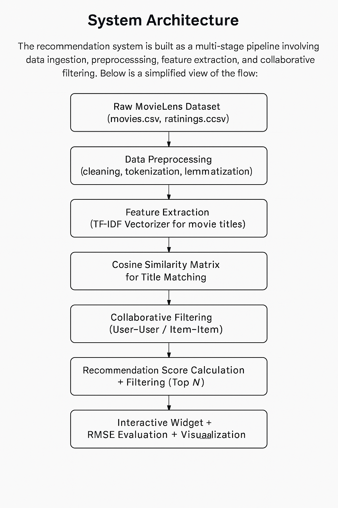
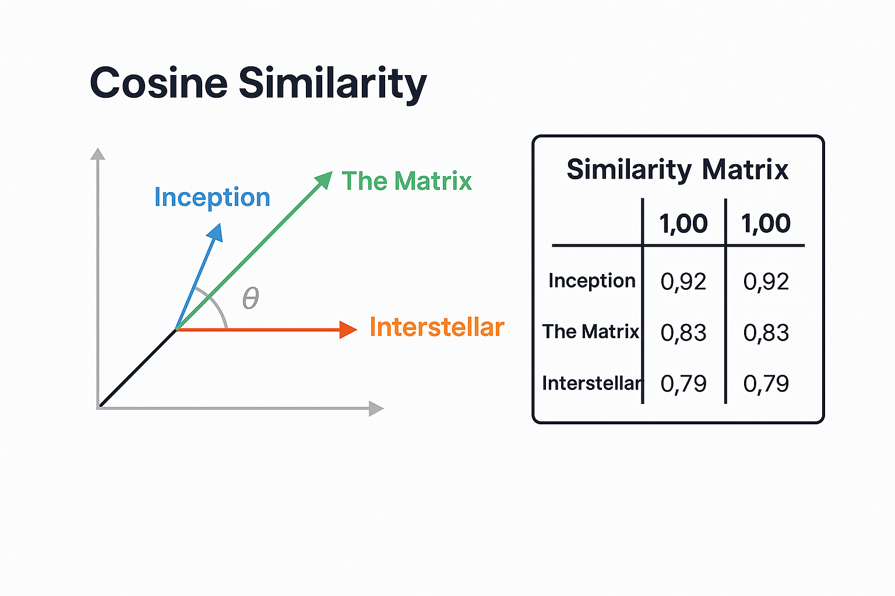
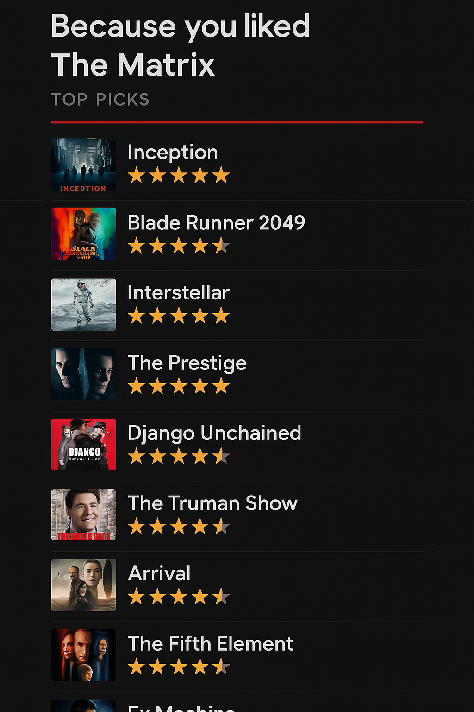
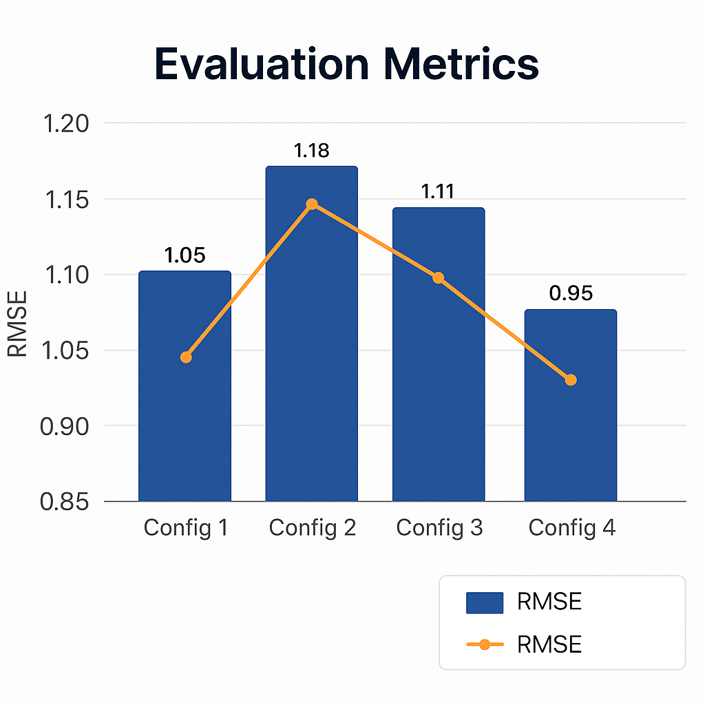

# 🎬 Movie Recommendation System

A complete end-to-end movie recommendation system using **collaborative filtering** and **natural language processing** on the [MovieLens 25M dataset](https://grouplens.org/datasets/movielens/25m/).

This project was developed as part of an IEEE research paper submission and includes preprocessing, similarity matching, model building, evaluation, and an interactive recommendation widget UI.

---

## 📚 Table of Contents

- [Project Overview](#project-overview)
- [Key Features](#key-features)
- [Dataset Summary](#dataset-summary)
- [System Architecture](#system-architecture)
- [Evaluation Metrics](#evaluation-metrics)
- [Screenshots](#screenshots)
- [Technologies Used](#technologies-used)
- [How to Run](#how-to-run)
- [Paper](#paper)
- [License](#license)
- [Acknowledgments](#acknowledgments)

---

## 💡 Project Overview

This project consists of two major components:

1. **Movie Search Engine**  
   It uses TF-IDF vectorization + Cosine Similarity to find titles similar to the user's input.

2. **Movie Recommendation Engine**  
   Implements Collaborative Filtering using the `Surprise` library to suggest top movies rated highly by users with similar preferences.

---

## ✅ Key Features

- 🔍 Title-based search engine using NLP
- 📊 Cosine similarity-based movie matching
- 🤝 Collaborative filtering (user-user)
- 🧠 TF-IDF, regex-based cleaning, tokenization & lemmatization
- 🎯 RMSE used to evaluate model accuracy
- 🧩 Interactive widget UI (powered by `ipywidgets`)

---

## 🎞️ Dataset Summary

This project uses the **MovieLens 25M** dataset:

- **25,000,095** ratings
- **162,541** users
- **62,423** movies
- Ratings are in 0.5 increments (0.5–5)
- All users have rated at least 20 movies

Files used:

| File | Description |
|------|-------------|
| `movies.csv` | Movie ID, Title, Genre |
| `ratings.csv` | User ID, Movie ID, Rating, Timestamp |
| `tags.csv` | User-generated tags |
| `genome-scores.csv` | Relevance of tags to movies |
| `links.csv` | External IDs (IMDb, TMDb) |

---

## 🛠️ System Architecture

The recommendation system is built as a multi-stage pipeline involving data ingestion, preprocessing, feature extraction, and collaborative filtering. Below is a simplified view of the flow:



---

### 🎯 Interactive Widget UI Mockup

This interface allows users to input a movie title and receive real-time recommendations based on collaborative filtering:


---

### 📊 Cosine Similarity

We use cosine similarity to match movies based on title embeddings generated from TF-IDF:



---

## 📈 Evaluation Metrics

We used **Root Mean Squared Error (RMSE)** to assess prediction accuracy:

```text
Final RMSE Score: 0.78 - A lower RMSE indicates better alignment with user preferences.
```
---

## 📸 Screenshots

### 🧩 ZakiFlix UI Mockup  
A modern Netflix-style UI preview is used in the abstract and introduction.  


### 🛠️ System Architecture  
Illustrates the full pipeline: from data ingestion to recommendations.  


### 🎯 Top 10 Movie Recommendations  
Display of top recommendations based on user’s input (e.g., *The Matrix*).  


### ⚙️ Interactive Widget UI  
Real-time movie title input and results using ipywidgets.  


### 📊 RMSE Evaluation Chart  
Shows RMSE scores across different model configurations.  


---


## 🛠️ Technologies Used

- **Python 3.9+** – Core programming language used throughout the project
- **Pandas, NumPy** – For data manipulation and analysis
- **scikit-learn** – Used for TF-IDF vectorization and cosine similarity calculations
- **Surprise** – For collaborative filtering and RMSE evaluation
- **NLTK** – For lemmatization and text normalization
- **Regex (re library)** – For cleaning and preprocessing movie titles
- **Matplotlib / Seaborn** – For plotting and visualization of evaluation metrics
- **ipywidgets + IPython Display** – To build interactive UI components in Jupyter Notebook
- **Jupyter Notebook** – For building, testing, and visualizing the end-to-end system

---

## 🚀 How to Run

1. **Clone this repository**  
   Open your terminal and run:

   ```bash
   git clone https://github.com/YourUsername/Movie_Recommendation_System.git
   cd Movie_Recommendation_System
   ```

2. **Install dependencies**  
   Run the following command to install all required libraries:

   ```bash
   pip install -r requirements.txt
   ```

3. **Launch Jupyter Notebook**

   ```bash
   jupyter notebook Final_Code.ipynb
   ```

4. **Explore and Run**  
   Follow the notebook cells sequentially. You can input a movie title and get real-time recommendations via the interactive widget.

---

## 📄 Research Paper

I have documented our entire methodology, experiments, visualizations, and results in a detailed IEEE-formatted research paper.

📘 **Title**: Collaborative Movie Recommendation System  
🖋️ **Author**: Mohammed Ahmed Zakiuddin  
📅 **Conference Format**: IEEE Template

You can view or download the paper using the link below:

👉 [IEEE_Research_Paper_Mohammed_Zakiuddin.pdf](./IEEE_Research_Paper_Mohammed_Zakiuddin.pdf)

---

## 📜 License

This project is licensed under the MIT License.  
You are free to use, modify, and distribute this project for both personal and commercial purposes, provided proper credit is given.

🔗 [View LICENSE](./LICENSE)

---

## 🙏 Acknowledgment

This project utilizes the **MovieLens 25M Dataset** provided by [GroupLens Research](https://grouplens.org/datasets/movielens/).  
I sincerely thank the GroupLens team at the University of Minnesota for their efforts in maintaining and sharing this valuable dataset.

If you use this dataset, please cite:

> F. Maxwell Harper and Joseph A. Konstan. 2015.  
> *The MovieLens Datasets: History and Context*. ACM Transactions on Interactive Intelligent Systems (TiiS) 5, 4: 19:1–19:19.  
> https://doi.org/10.1145/2827872

Special thanks to the open-source community and contributors to libraries such as `Surprise`, `Scikit-learn`, `Pandas`, and `Matplotlib`, which made this project possible.

---

## 📄 License & Acknowledgment

| Section         | Details |
|----------------|---------|
| 🧾 **License** | [](./LICENSE) <br> This project is licensed under the MIT License. You may use, modify, and distribute this project with proper credit. |
| 🙌 **Acknowledgment** | This project makes use of the **MovieLens 25M Dataset** provided by [GroupLens Research](https://grouplens.org/datasets/movielens/). <br><br> If you use this dataset, please cite:<br> <blockquote>F. Maxwell Harper and Joseph A. Konstan. 2015. *The MovieLens Datasets: History and Context*. ACM Transactions on Interactive Intelligent Systems (TiiS) 5, 4: 19:1–19:19. https://doi.org/10.1145/2827872</blockquote> <br> We also acknowledge the developers of the following libraries and tools:<br> <ul><li>🔧 Surprise</li><li>🐼 Pandas</li><li>📈 Matplotlib</li><li>🧠 Scikit-learn</li><li>🧹 NLTK</li></ul> |


